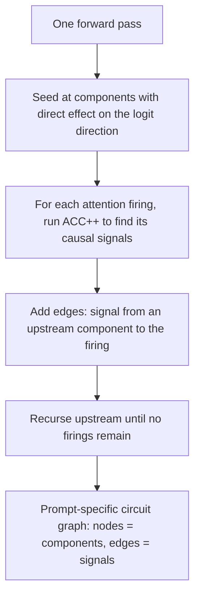

<div class="callout">
<strong>Paper (preprint, under review)</strong>
<a href="https://arxiv.org/abs/2602.13483">Finding Interpretable Prompt-Specific Circuits in Language Models</a><br>
Code and experiments: <a href="https://github.com/gaabrielfranco/finding-highly-interpretable-circuits">finding-highly-interpretable-circuits</a> &middot;
Library: <a href="https://github.com/gaabrielfranco/accpp-tracer">accpp-tracer</a>
</div>

<div class="callout">
<strong>TLDR</strong>
A crucial part of finding circuits is understanding <em>why each attention head attends where it does</em>.

<strong>ACC++</strong> extracts interpretable prompt-specific circuits from a single forward pass, without replacement models or patching. Circuits consist of components that are causal for the model's attention decisions, together with the low-dimensional signals used to communicate between them.

Because it works one prompt at a time, ACC++ lets us ask questions that circuit-level tracing usually can't: it reveals that <em>there is no single circuit for IOI</em>, and that across languages, <em>components are reused but signals are language-specific</em>.
</div>

## The question

Attention is the main way transformers move information between tokens <d-cite key="NIPS2017_3f5ee243"></d-cite>.
Mechanistic interpretability aims to explain model behavior in terms of _circuits_: a circuit is not merely a correlated set of neurons or features, but a set of causal pathways — specific components write information into the residual stream, and downstream components selectively read and transform it <d-cite key="Elhage21"></d-cite>.

A crucial part of finding circuits is understanding **why each attention head attends where it does**. When an attention head attends to a particular token pair, that choice is determined by features written into the token representations by upstream components. To trace a circuit, one can seek to isolate the small subset of upstream contributions that are in fact causal for that attention decision.

This post assumes you know basic ML and transformers, but not the circuits framing. If you want background, Olah et al. is a good intro <d-cite key="olah2020zoom"></d-cite>, and the transformer circuits framework gives the bigger picture <d-cite key="Elhage21"></d-cite>.

## From ACC to ACC++

The **attention-causal communication (ACC)** problem, introduced in our prior work [Pinpointing Attention-Causal Communication in Language Models, NeurIPS 2025](https://openreview.net/forum?id=wUoK24u4x7), formalized this goal for a fixed destination–source token pair: find a small subspace and a small set of _signals_ — upstream components writing into that subspace — such that removing those contributions from the residual stream would cause the head to _not_ attend to the token pair. ACC builds this subspace from the singular vectors of the head's query–key (QK) matrix, leveraging their alignment with meaningful features in the residual stream <d-cite key="merullo2024talkingheadsunderstandinginterlayer"></d-cite><d-cite key="franco2024sparseattentiondecompositionapplied"></d-cite>.

**ACC++** makes two conceptual advances and one technical advance over ACC.

On the conceptual side, ACC++ (1) _dramatically sharpens the identification of candidate signals_ by identifying them more precisely with subspace–component pairs, and (2) _more accurately measures attention causality_ by defining its objective directly on the head's nonlinear Softmax-derived attention. In comparison, prior work (1) identified subspaces and upstream components independently, leading to higher-dimensional and potentially less-interpretable signals; and (2) used a linear surrogate for attention in the trace, which introduced spurious components. We find that these two advances yield signals which frequently admit a short natural-language description, and circuits that are much less noisy without sacrificing causality of attention.

The technical advance addresses heterogeneity in model architecture: under mild full-rank assumptions, it is always possible to construct a single QK matrix for each attention head, such that the matrix correctly computes attention regardless of whether bias or Rotary Positional Embeddings (RoPE) is used in the particular model. Among other benefits, this vastly simplifies the use of SVD-based analysis of QK matrices in real models.

## How ACC++ works

{% include figure.liquid loading="eager" path="assets/img/posts/accpp/fig1_method.png" class="img-fluid rounded z-depth-1" zoomable=true caption="ACC++ method (destination side; source side is analogous). Given an attention head attending to a token pair (d, s), ACC++ identifies which upstream contributions drive the attention in four steps: (a) select head and token pair, (b) decompose the destination residual, (c) construct candidate signals from singular directions, and (d) compute attribution by Integrated Gradients and greedily remove." %}

ACC++ identifies the signals causal for a single attention firing — a head $(\ell, a)$ attending to a token pair $(d, s)$ — in four steps:

1. **Select head and token pair.** Fix the target head $(\ell, a)$ and token pair $(d, s)$.
2. **Decompose the destination residual.** Write the destination residual $\mathbf{x}^d$ as a sum of upstream component outputs (token embeddings, earlier attention heads, and feedforward modules).
3. **Construct candidate signals.** Project each component output $\mathbf{o}_c^d$ onto the left singular vectors $\{\mathbf{u}_k\}$ of the head's QK matrix $\Omega$, so that every (component, direction) pair yields one rank-1 candidate. This exhaustive cross-product of _all_ upstream component outputs with _all_ singular-vector channels is what produces a smaller, more precise set of candidate signals than considering components and channels separately.
4. **Score and greedily remove.** Score candidates by their contribution to the true attention weight $A_{ds}$ using Integrated Gradients, then greedily remove the top-ranked candidates until $A_{ds} < \tau$. The removed set is the small set of signals causal for that firing.

The source side is analogous, using right singular vectors. This is a key point where ACC++ diverges from prior work, which operated on a pre-Softmax linear surrogate: ACC++ evaluates the nonlinear Softmax explicitly, allowing it to identify much smaller circuits that are still causal for attention.

We define a **circuit** for a prompt as the directed graph traced by applying ACC++ recursively across the model. Its nodes are model components, and each edge is a signal returned by ACC++, linking an upstream component to a downstream attention firing along a specific subspace. We build the circuit by seeding at the components with a direct effect on the logit direction of interest (e.g., the correct-answer direction), running ACC++ on each attention firing in the current trace, and recursing upstream until none remain.



There is no tuning involved beyond the threshold $\tau$: no replacement models to train, and no counterfactual prompts to formulate.

## Circuits are small and stay causal

ACC++ is used to trace circuits for Indirect Object Identification (IOI) <d-cite key="DBLP:conf/iclr/WangVCSS23"></d-cite>, Greater-Than (GT) <d-cite key="hanna2023does"></d-cite>, and Gender Pronoun (GP) <d-cite key="athwin2identifying"></d-cite> in GPT-2 Small <d-cite key="radford2019language"></d-cite>, Pythia-160M <d-cite key="biderman2023pythia"></d-cite>, and Gemma-2 2B <d-cite key="team2024gemma"></d-cite>. ACC++ recovers circuits with high overlap (precision, recall, and F1) against reference circuits and against patching-based methods, while producing circuits that are **from 2× to 10× smaller** than ACC traces — with 50% to 90% fewer components — all while preserving the traced attention decisions under a counterfactual attention-weight criterion.

The signals present in these circuits are also lower-dimensional than ACC's: across IOI, GP, and GT, the majority use a _single_ singular direction of $\Omega$. Ablating subsets of the signals selected by ACC++ has a measurable causal effect on the model's IOI performance while only minimally perturbing the residual stream, with post-ablation cosine similarity close to 0.99 and norm ratio close to 1.

## A substantial fraction of signals are interpretable

A key benefit of the attention-causal communication approach is that it can trace circuits on a _per-prompt_ basis, and the availability of interpretable prompt-specific circuits opens additional avenues for understanding model behavior.

To interpret signals, we construct a short natural-language description of each signal (i.e., each edge in the trace). We adapt the fully automated autointerpretation framework used for Sparse Autoencoder (SAE) features <d-cite key="BrickenSAEs"></d-cite>: starting from a signal identified by ACC++, we (i) retrieve high-activation contexts by scoring token pairs in cached activations from The Pile <d-cite key="ThePile"></d-cite>, (ii) prompt an LLM to propose a short natural-language description of the signal from these contexts, and (iii) evaluate the description with an LLM-as-a-judge protocol.

ACC++ signals achieve autointerpretation performance that _approaches SAE-feature baselines_ — a notable result, since SAE features are explicitly trained to separate superposed features, while ACC++ signals arise directly from causal attention interactions. Using a hypothesis-testing criterion (False Discovery Rate $\le 5\%$), the fraction of interpretable signals varies across models: **63%** (95% CI: 62–64%) in GPT-2 Small, **50%** (49–51%) in Pythia-160M, and **31%** (30–32%) in Gemma-2 2B. This suggests that many ACC++ signals correspond to consistent attention interactions rather than noise.

{% include figure.liquid loading="eager" path="assets/img/posts/accpp/fig5_traces.png" class="img-fluid rounded z-depth-1" zoomable=true caption="Traces are interpretable and expose algorithmic differences in circuits between ABBA and BABA in GPT-2. AH node labels are (destination token, source token); edge labels are automatically generated. Red: feeds logits; purple: low-level; orange: provide inhibition signal. Dark green nodes show that, in BABA only, the circuit relies on identifying the second item in a parallel pair, i.e. Kelly, as the appropriate output." %}

## There is no single circuit for IOI

IOI is a canonical benchmark in mechanistic interpretability. The task has sentences of the form "When Mary and John went to the store, John gave the bottle to", where the model should answer "Mary" instead of "John". Here we ask a more specific question: _how much of the variation across prompts is driven by prompt structure, and how can signal-level traces explain the difference?_

We use a collection of IOI prompts balanced across two levels of templates: two high-level templates (reversing the role order of the two names, i.e. ABBA vs. BABA), and 15 low-level templates (changing surface wording, e.g. "While ..." vs "Then..."). Tracing every IOI prompt separately, prompt-specific circuits form **well-defined clusters, dominated by prompt templates**.



The relevant form of variation is model-dependent: **GPT-2 is strongly sensitive to role order (ABBA vs. BABA), whereas Pythia is more sensitive to surface wording**. In GPT-2 Small, the dendrogram splits cleanly into one ABBA cluster and one BABA cluster, with no clear substructure related to low-level template. Pythia-160M instead has a larger number of smaller clusters, each aligned with low-level template groups.

Crucially, across clusters, heads receive systematically different signals. The name-mover head $(9,9)$ fires in _both_ formats, but receives markedly different input signals between ABBA and BABA, even though these signals are carried on the same token. In the BABA case, the indirect object appears after the subject, and the model tags it with the feature "second item in a parallel pair"; head $(9,9)$ then attends to that pair and moves the indirect object to the output. In contrast, in the ABBA circuit the indirect object comes before the subject and so cannot be identified as the "second item"; the key features are instead more generic structural cues, such as "structural or sequence-completing token."

So ACC++ does not just recover that GPT-2 uses different circuits for ABBA and BABA; it shows that the same head $(9,9)$ can implement its function using different incoming signals, and lets us describe what those signals are doing.

## Multilingual IOI - shared mechanisms, language-specific signals

The sensitivity of IOI circuits to prompt structure shows that even when components are reused across task variants, the signals involved may differ in important ways. We next explore this in a setting where differences between prompt types are substantially greater: multilingual task variation, extending IOI to a dataset spanning English, Spanish, French, and Portuguese (using mGPT, with a similar analysis for Gemma-2 2B).

Prior work has shown that models can use the same components when processing IOI prompts and their translation into another language. We confirm that ACC++ also recovers this component reuse. However, because ACC++ clusters circuits based on _signal_ use as well as component use, it shows more than just component reuse: **components are reused across languages, but the signals they carry are often language-specific**.



As in the monolingual case, the primary clustering feature is template structure: prompts sharing the same high-level template group together regardless of language. But within each high-level template cluster there is a _secondary_ grouping: prompts cluster by language. This secondary clustering indicates that, together with shared mechanisms, circuits also incorporate language-specific signals.

Finally, this secondary structure is not arbitrary. We compute the average circuit distance between paired prompt traces for each language pair and correlate it against typological distance from URIEL+. Cross-language circuit distances show positive correlations with URIEL+ syntactic ($r = 0.83$) and genetic ($r = 0.88$) distance for mGPT, with the same pattern in Gemma-2 2B ($r = 0.80$ and $r = 0.84$). The consistency of the trend suggests that cross-language circuit distance mirrors the relatedness of these languages.

## Limitations

ACC++ has some limitations that we leave to future work. First, the method depends on setting the threshold $\tau$, and we use a heuristic based on the distribution of $d \cdot A_{ds}$ per model/dataset; a principled, dataset-agnostic rule for $\tau$ is left to future work. Second, ACC++ circuits do not trace the upstream components that caused feedforward modules to output an attention-causal signal. Third, because our signal interpretations rely on an LLM as a judge, the interpretations are suggestive but not conclusive. Finally, the multilingual analysis, including the correlation with URIEL+ distances, is based on a small number of language pairs and should also be read as suggestive rather than conclusive.

## Cite

```bib
@article{franco2026finding,
  title={Finding Interpretable Prompt-Specific Circuits in Language Models},
  author={Franco, Gabriel and Tassis, Lucas M. and Rohr, Azalea and Crovella, Mark},
  journal={arXiv preprint arXiv:2602.13483},
  year={2026}
}
```
