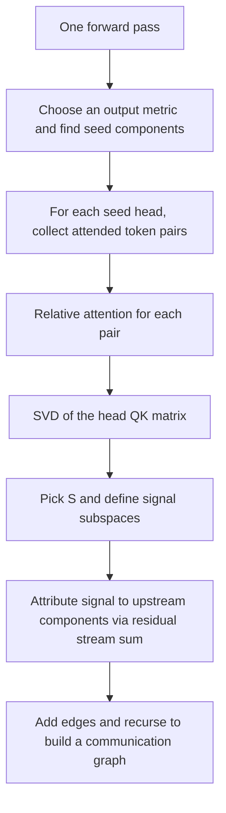

<div class="callout">
<strong>Paper (NeurIPS 2025)</strong>
<a href="https://openreview.net/forum?id=wUoK24u4x7">Pinpointing Attention-Causal Communication in Language Models</a><br>
</div>

<div class="callout">
<strong>TLDR</strong>
When an attention head attends from one token to another, it is because some information in the residual stream made that token pair stand out.

This post explains a method that isolates that information as a small, low dimensional signal, and then traces where the signal was written from, using only one forward pass.

The same signal view also reveals a simple mechanism behind attention sinks and shows global coordination across heads through shared control signals.
</div>

## The question

<!-- CHANGED: Grammar and terminology updates for consistency with the paper. -->
Attention is the main way transformers move information between tokens <d-cite key="NIPS2017_3f5ee243"></d-cite>.
So it is natural to ask:

When a head attends from token d to token s, what caused that choice?

The paper calls this **attention-causal communication**.
We want to identify a low dimensional feature that is:

1. Written into tokens by upstream components
2. Read by a head QK pattern
3. Causal for the head attending to a specific token pair

This post assumes you know basic ML and transformers, but not the mechanistic interpretability circuits framing.
If you want more background, Olah et al is a good intro <d-cite key="olah2020zoom"></d-cite>, and the transformer circuits framework gives the bigger picture <d-cite key="Elhage21"></d-cite>.

## The core idea

Most circuit tracing methods lean on interventions.
A common pattern is activation patching: run the model many times with counterfactual prompts, patch internal activations, and measure what changes <d-cite key="goldowskydill2023localizingmodelbehaviorpath"></d-cite><d-cite key="zhang2024bestpracticesactivationpatching"></d-cite>.

This paper takes a different route.
We make attention easier to analyze by doing two things.

First, we swap Softmax attention weight for a linear proxy called relative attention.

Second, we analyze that proxy in the singular vector basis of the head QK matrix.

Together, these give a direct way to extract a small signal that is provably tied to the head attending above uniform baseline.

## From attention to a small signal

### Step 1: use relative attention

Fix a head, a layer, and a destination token position d.
The head produces a raw attention score for each possible source s.
Softmax turns these raw scores into attention weights.

Softmax is the problem.
Whether a weight is large depends on all the scores together.

So we look at a quantity that is easier to reason about.

Relative attention asks:

How much larger is the raw score for this source token than the average raw score to the other tokens.

The key fact is:

If the Softmax attention weight on (d, s) is at least 1 divided by n, then relative attention is positive.

So we can treat the attention question as a sign test:

Did the model push relative attention above zero.

<details>
<summary><strong>Show the definition and the lemma</strong></summary>

Let $A'_{ds}$ be the raw score and $A_{ds}$ be the Softmax weight.
Let $n$ be the number of tokens in the Softmax for destination token $d$.

The relative attention is:

$$
c_{ds} = A'_{ds} - \frac{1}{d-1}\sum_{j \le d,\ j \ne s} A'_{dj}.
$$

The paper proves:

If $A_{ds} \ge 1/n$ then $c_{ds} > 0$.

</details>

### Step 2: expand relative attention in the QK singular basis

For a head, the raw attention score is a bilinear form in the destination and source token residuals:

$$
A'_{ds} = x_d^\top \Omega x_s,\quad \Omega = W_Q W_K^\top.
$$

Now take the singular value decomposition of Ω.
This gives a set of singular directions that the head uses as a communication basis.

When we rewrite relative attention in this basis, it becomes a sum of per direction contributions.

The empirical surprise is that the sum is usually sparse.
Only a small number of singular directions explain most of the positive relative attention.

This matches, and strengthens, earlier observations that QK structure exposes low dimensional channels <d-cite key="NEURIPS2024_6216515a"></d-cite><d-cite key="merullo2024talkingheadsunderstandinginterlayer"></d-cite><d-cite key="franco2024sparseattentiondecompositionapplied"></d-cite>.

<!-- CHANGED: Replaced placeholder with paper-aligned quantitative summary. -->
<aside><p>
<strong>Figure 1 summary:</strong> Across IOI, greater-than, and gender-pronoun tasks, the fraction
of singular directions used in the signal set is usually small. The paper reports that models
typically use about 5-10% of available dimensions (roughly 3-6 out of 64 in GPT-2/Pythia,
and about 13-25 out of 256 in Gemma-2).
</p></aside>

<!-- CHANGED: Replaced per-panel Figure 1 images with a single merged image. -->


Across GPT 2 small <d-cite key="radford2019language"></d-cite>, Pythia 160M <d-cite key="biderman2023pythia"></d-cite>, and Gemma 2 2B <d-cite key="team2024gemma"></d-cite>, and across tasks like IOI, greater than, and gender pronoun prediction <d-cite key="DBLP:conf/iclr/WangVCSS23"></d-cite><d-cite key="hanna2023does"></d-cite><d-cite key="athwin2identifying"></d-cite>, the signal is often about 5 to 10 percent of the available key and query dimensions.

<!-- CHANGED: Replaced Chart.js block with plain text summary. -->
A compact summary:

1. GPT-2 small: R = 64, typical signal size about 3 to 6 dimensions
2. Pythia 160M: R = 64, typical signal size about 3 to 6 dimensions
3. Gemma 2 2B: R = 256, typical signal size about 13 to 25 dimensions

### Step 3: define the signal and its causal meaning

Now we can define a signal for a specific attended token pair.

Pick a head and a token pair (d, s) where the head attends above uniform baseline.
Compute the per direction contributions to relative attention.
Sort them from largest to smallest.
Take the smallest set of positive contributions whose sum exceeds the observed relative attention.
Call this set $S_{ds}$.

From $S_{ds}$ we get two low dimensional subspaces:

1. U, a destination subspace from left singular vectors
2. V, a source subspace from right singular vectors

Project the destination token into U and the source token into V.
Those projections are the **attention causal signals**.

The causal claim is direct:

If we remove the signal from the head inputs, relative attention drops below zero, so the head no longer attends above the 1 divided by n baseline.

This is what makes the method feel different from pattern matching on attention maps.
It gives a concrete, low dimensional, causal object.

## Tracing signals into a communication graph

Signals tell us what a head is reading.
But we also want to know who wrote the signal.

The key structure is the residual stream sum.
Each token residual is the sum of many upstream contributions: earlier heads, earlier MLPs, and the input embedding <d-cite key="Elhage21"></d-cite>.

Relative attention is linear in its inputs.
So once we have a projector onto the signal subspace, we can distribute relative attention over the residual stream sum and measure which upstream components contributed to the signal.

This builds a communication graph:

1. Nodes are model components, heads and MLPs
2. Edges say: this component wrote a signal into token d that caused some head to attend to token s

Starting from an output metric, the paper traces backwards through this graph to get a prompt specific circuit trace.

Here is the full pipeline.



<!-- CHANGED: Replaced placeholder with a precise summary of Figure 3. -->
<aside><p>
<strong>Figure 3 summary:</strong> Aggregated communication graphs differ by model. GPT-2 and
Pythia show strong duplication-sensitive structure in IOI prompts, while Gemma-2 uses a different
information-aggregation pattern with a distinct anchor token strategy.
</p></aside>

<!-- CHANGED: Replaced per-panel Figure 3 images with a cropped merged image. -->


## What we learn from the results

### Signals are tiny, but interventions are strong

A striking point is how small the signal is.
For GPT 2 and Pythia, it is often only a handful of dimensions out of 64.

Yet interventions on these signals can change behavior a lot.
The paper ablates or boosts traced signals and measures a logit difference metric.
Ablating task relevant signals hurts performance.
Boosting them helps.

At the same time, the token residual vectors barely move.
The paper reports average relative norm changes under 1 percent, and cosine similarity typically above 0.99.

This is exactly what we want from a feature level causal story: small edits that matter.

<!-- CHANGED: Replaced placeholder with paper-aligned intervention summary. -->
<aside><p>
<strong>Figure 2 summary:</strong> Across models and tasks, ablating traced signals reduces task
performance, while boosting traced signals improves performance. The paper also reports very small
residual perturbations during these interventions: average relative norm change under 1% and cosine
similarity typically above 0.99.
</p></aside>

<!-- CHANGED: Added Figure 2 intervention plot from paper PDF converted to PNG. -->


### Circuit discovery from one pass matches known structure

The paper traces circuits on IOI, greater than, and gender pronoun tasks, in GPT 2, Pythia, and Gemma 2.

It then compares the resulting circuits to earlier circuit work, including edge pruning and ACDC <d-cite key="bhaskar2025finding"></d-cite><d-cite key="conmy2023automatedcircuitdiscoverymechanistic"></d-cite>.

The circuits are broadly consistent, but found with far fewer runs, because the method does not rely on repeated counterfactual interventions.

<!-- CHANGED: Replaced placeholder with circuit-comparison summary from the paper. -->
<aside><p>
<strong>Figure 4 summary:</strong> The circuits found by this method are broadly consistent with
first-reported circuits and with methods such as edge pruning, ACDC, and EAP, while using a
single forward pass for prompt-specific tracing.
</p></aside>

<!-- CHANGED: Added Figure 4 circuit comparison plot from paper PDF converted to PNG. -->


### Control signals explain attention sinks and head coordination

Beyond circuits, the signal view gives a new angle on global model behavior.

Many attention decisions are not about content.
They are attention sinks: heads attending to a special token like the first token when they do not need to route information.
Attention sinks have been studied before <d-cite key="xiao2024efficientstreaminglanguagemodels"></d-cite>.

This paper shows that attention sinks are driven by simple control signals.

1. A source control signal that lives in the sink token
2. A destination control signal that lives in many tokens

When a head uses this control signal pair, it attends to the sink token.

The paper reports that typically more than 80 percent of attended token pairs are attention sinks in its experiments.

Even more, control signals cluster.
There are only a few distinct control signals, and groups of heads share them.
This suggests a form of model wide coordination: heads are organized through shared low dimensional control channels.

The paper also shows control signals predict sink behavior very well, with high F scores:

1. GPT-2 small: 0.965
2. Pythia 160M: 0.952
3. Gemma 2 2B: 0.994

<!-- CHANGED: Replaced placeholder with control-signal clustering summary. -->
<aside><p>
<strong>Figure 5 summary:</strong> Control signals form a small number of clusters, and heads
using the same control signal tend to appear in organized groups across layers and heads, suggesting
model-wide coordination.
</p></aside>

<!-- CHANGED: Replaced per-panel Figure 5 images with a single merged image. -->


A practical takeaway is that control signals can act like switches.
Boosting a control signal tends to push a head into sink behavior, even when the prompt changes.

## A brief comparison to patching

Patching based tracing finds causal components by repeated interventions on activations.

Signal tracing flips the order:

1. First isolate a low dimensional causal signal for attention
2. Then attribute that signal back through a linear decomposition of the residual stream

In practice this means fewer runs, no counterfactual prompt design, and a very direct link between the traced object and the attention mechanism itself.

## Limitations

The method has real limitations.

First, tracing attention has quadratic scaling in the number of tokens, so long contexts are expensive.

Second, the sparse decomposition step is heuristic.
It works well empirically, but it is not a proof that we found the unique best signal.

Third, the method is built around attention QK structure.
It can trace signal writers that are MLPs, but it does not directly define a comparable causal feature object for MLP computations.

Finally, the control signal result raises new questions.
Why do these clusters exist, and what training pressures create them.

## Cite

```bib
@inproceedings{
franco2025pinpointing,
title={Pinpointing Attention-Causal Communication in Language Models},
author={Gabriel Franco and Mark Crovella},
booktitle={The Thirty-ninth Annual Conference on Neural Information Processing Systems},
year={2025},
url={https://openreview.net/forum?id=wUoK24u4x7}
}
```

## Appendix

<details>
<summary><strong>Minimal recipe for extracting a signal</strong></summary>

Given a head and an attended pair (d, s):  
  
1. Compute relative attention $c_{ds}$  
2. Decompose $c_{ds}$ into per singular direction contributions of $\Omega$  
3. Sort contributions, keep the smallest set of positive terms summing above $c_{ds}$, call it $S_{ds}$  
4. Let U and V be the spans of the corresponding left and right singular vectors  
5. The destination signal is $P_U x_d$  
6. The source signal is $P_V x_s$  
  
The tracing algorithm builds a communication graph by attributing these signal projections back to upstream residual stream components.

</details>

<aside><p>
The paper also describes how to extend the method to models with attention bias terms and RoPE positional encoding.
These details matter in practice, but they do not change the main idea.
</p></aside>
